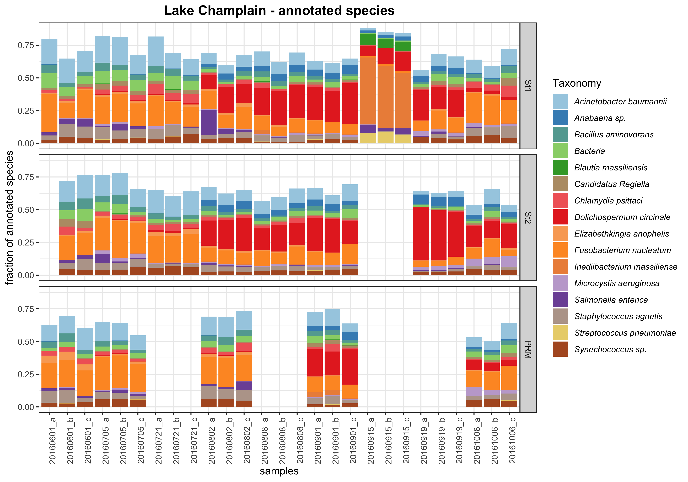
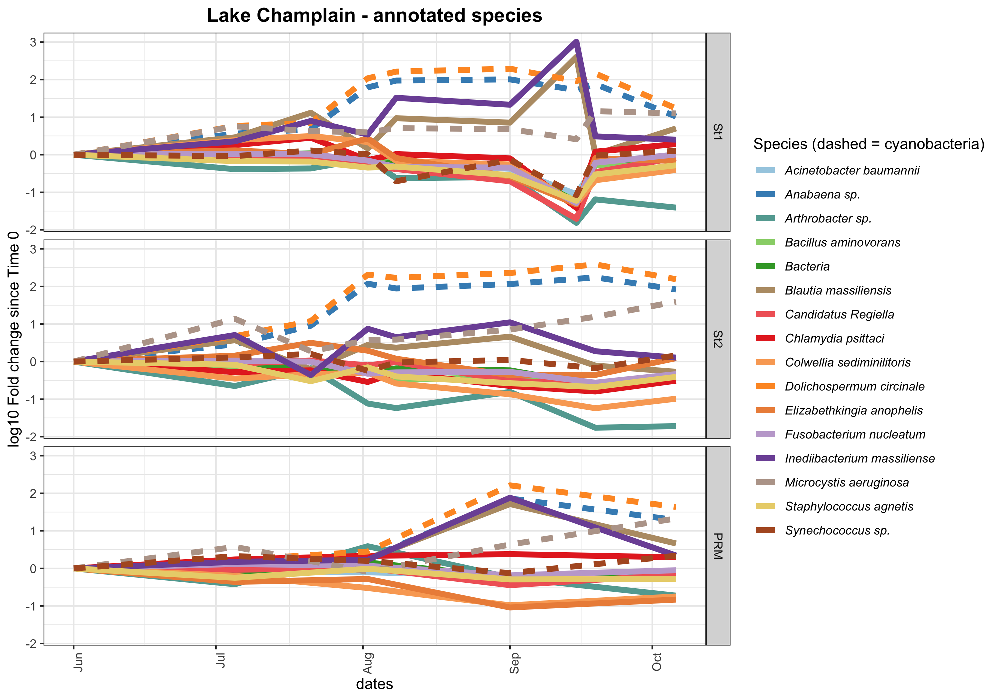
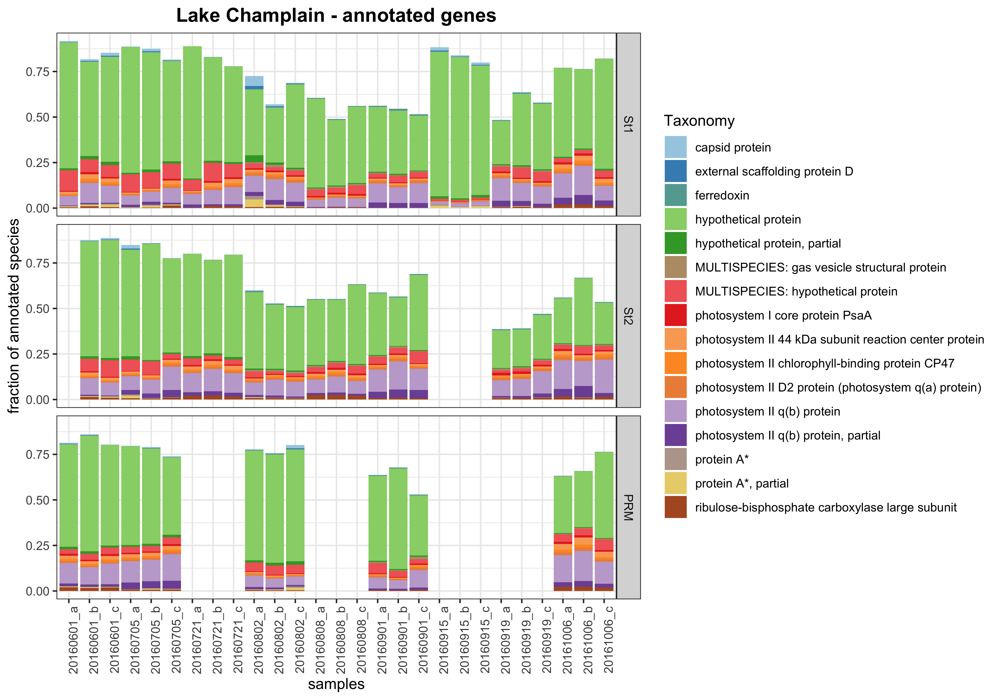
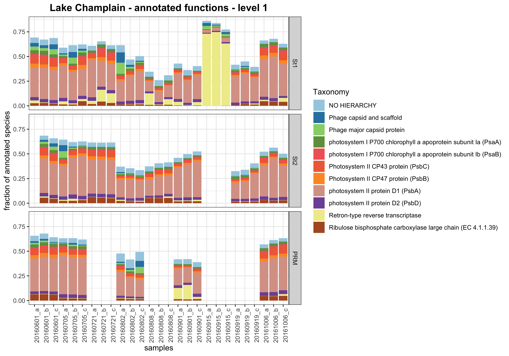
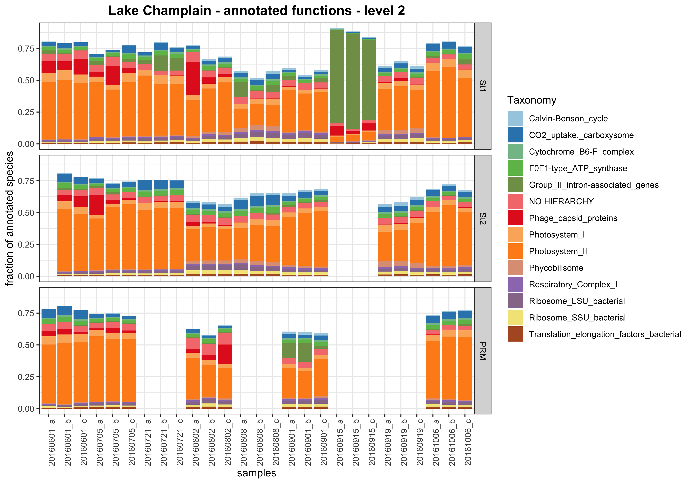
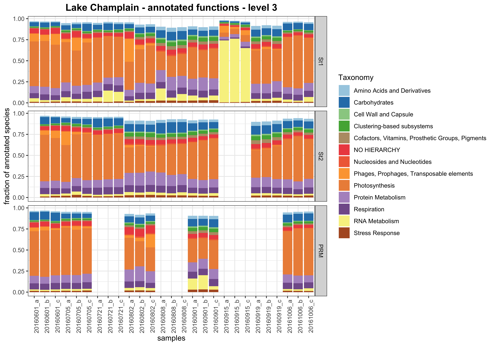
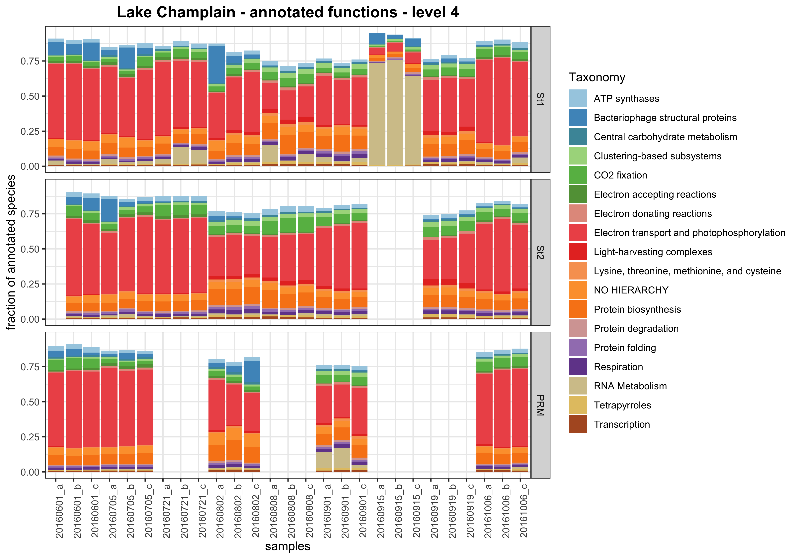
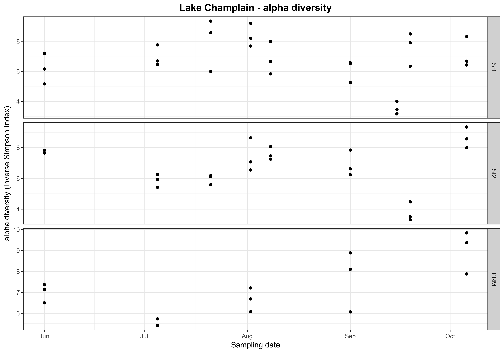

#SAMSA2 
• [Westreich *et al.* 2018. SAMSA2: standalone metatranscriptome analysis pipeline. BMC Bioinformatics](https://www.ncbi.nlm.nih.gov/pmc/articles/PMC5963165/)  
• [github repo](https://github.com/transcript/samsa2)    
{width=500px}  
{width=500px}  
&nbsp;  
  
##RefSeq database
• Non-redundant set of reference proteins (predicted+verified)  
• Contains species + protein name  
• 27G, 68M sequences

##Subsystems database
• SEED is a categorization system which organizes gene functional categories into a hierarchy (4 levels)  
• 7.6G, 2.9M sequences

#Data
• 2016 Lake Champlain algal bloom samples  
• Metatranscriptomes (2 X 100bp Illumina HiSeq)  
• 3 sampling site: PRM (15 samples), St1 (27 samples), St2 (23 samples)  
• 130 fastq samples (79G of fastq.gz data)  

#Running the pipeline
• Compute Canada (Cedar)  
• I ran the pipeline seperately for each sampling site   
• 48 CPUs, ~15hr X 3 sampling sites  
 
#Results

##Merging
```{r merging, warning = F, message = F, echo=F}  
pe_assembly = read.table("../results/summary_stats/pe_assembly",stringsAsFactors = F)
pe_assembly[,7] = sub("%","",pe_assembly[,7],fixed=T)
pe_assembly[,7] = sub("(","",pe_assembly[,7],fixed=T)
pe_assembly[,7] = sub(")","",pe_assembly[,7],fixed=T)
hist(as.numeric(pe_assembly[,7]),xlab = "% merged",main= "merging PE")
paste(signif(mean(as.numeric(pe_assembly[,7])),4)," % of sequences were merged",sep = "")
paste("Does merging make sense? Depending on size selection of amplicons sequenced (should check)")
```    

##Trimmomatic
```{r trimmo, warning = F, message = F, echo=F}  
trimmed = read.table("../results/summary_stats/trimmed",stringsAsFactors = F)
trimmed[,9] = sub("%","",trimmed[,9],fixed=T)
trimmed[,9] = sub("(","",trimmed[,9],fixed=T)
trimmed[,9] = sub(")","",trimmed[,9],fixed=T)
hist(as.numeric(trimmed[,9]),xlab = "% dropped",main= "Trimmomatic")
paste(signif(mean(as.numeric(trimmed[,9])),4)," % of sequences were dropped",sep = "")
```  


##Ribosomes
```{r ribo, warning = F, message = F,echo=F}  
ribosomes = read.table("../results/summary_stats/ribosomes",stringsAsFactors = F)
ribosomes[,9] = sub("%","",ribosomes[,9],fixed=T)
ribosomes[,9] = sub("(","",ribosomes[,9],fixed=T)
ribosomes[,9] = sub(")","",ribosomes[,9],fixed=T)
hist(as.numeric(ribosomes[,9]),xlab = "% ribosomes",main = "Ribosomes")
paste(signif(mean(as.numeric(ribosomes[,9])),4)," % of sequences were ribosomes and removed",sep = "")

print("Three samples had a high % of ribosomes removed")
min50 = ribosomes[as.numeric(ribosomes[,9])>50,]
min50_n = unlist(strsplit(min50[,1],"/"))[c(8,16,24)]
min50[,1] = unlist(strsplit(min50_n,"_merg"))[c(1,3,5)]
min50[,c(1,9)]
```  

##Other stats
```{r annot, warning = F, message = F,echo=F}
refseq = read.table("../results/summary_stats/refseq",stringsAsFactors = F)
subsys = read.table("../results/summary_stats/subsys",stringsAsFactors = F)

#refseq
paste(min(refseq[,1]),": mininum nb sequence annotated per sample (refseq)",sep = "")
paste(max(refseq[,1]),": maximum nb sequence annotated per sample (refseq)",sep = "")
paste(signif(mean(refseq[,1]),4),": mean nb sequence annotated per sample (refseq)",sep = "")

#subsys
paste(min(subsys[,1]),": mininum nb sequence annotated per sample (subsys)",sep = "")
paste(max(subsys[,1]),": maximum nb sequence annotated per sample (subsys)",sep = "")
paste(signif(mean(subsys[,1]),4),": mean nb sequence annotated per sample (subsys)",sep = "")

#Total Number of sequences (~20k sequences / megabyte of fastq.gz)
summary_counts = read.table("../results/summary_stats/summary_counts",stringsAsFactors = F)
nb_seq = 79*1000*20000 #rough average
nb_seq = round(sum(summary_counts[,1])/4000000000,4) #exact number (rough average was ~90% the same...)
paste(nb_seq,": Total Number of paired-end reads (billions)",sep = "")

#Total Number of sequences after cleaning (~20k sequences / megabyte of fastq.gz)
#remember that here a merged sequence is composed of the 2 PEs
nb_seq_clean = (nb_seq/2) * (mean(as.numeric(pe_assembly[,7]))/100) * (1-(mean(as.numeric(trimmed[,9]))/100)) * (1-(mean(as.numeric(ribosomes[,9]))/100))
paste(signif(nb_seq_clean,2),": Total Number of sequences after cleaning+merging (billions)",sep = "")
#What fraction of sequences are annotated 

#refseq
paste(signif(sum(refseq[,1])/(nb_seq_clean)*100,4),"% : percentage of sequences annotated (refseq)",sep = "")

#subsys
paste(signif(sum(subsys[,1])/(nb_seq_clean)*100,4),"% : percentage of sequences annotated (subsys)",sep = "")
```  
• Note: *Diamond* threshold (default=0.001: kinda high, but most keep high, given that these are short reads, even if merged...)...    
• Note: threshold may not be that important, given that we are more interested in how *things* change over time...      
  
##RefSeq annotations - species
```{r barplots, warning = F, message = F,out.width=1050,out.height=1200,fig.align='center',echo=F}

```
&nbsp;  
&nbsp;  
    
• Here I only show *spp.* that are present >5% in at least one of the samples  
• We can see the *Dolichospermum* bloom  
• What is going in the St1 samples on Sept 15th?  
• *Inediibacterium massiliense* and *Blautia massiliensis* are human fecal bacteria...  

###Environmental data (N,P,Chl)
• Huge peak in values on Sept 9th, 2016.  
```{r environmental data, warning = F, message = F,out.width=800,out.height=900,fig.align='center',echo=F}
knitr::include_graphics("../figures/environmental_data.png")
```
&nbsp;  
&nbsp;


###*I. massiliense*  
• All *I. massiliense* 20160915_St1 sequences match to a single hypothetical (*i.e predicted*) protein (*WP_053955528.1*) in refseq.  
• *e-values* ~e-20 (because sequences are small + sequence identity ~90%)  

####*I. massiliense* genome BLAST  
• Download *I. massiliense* genome.    
• BLASTn sequences (for now only 100k sequences) against it.    
• 20160915_St1: hits to a single region of ~150bp (sequence identity ~90%, **6206** hits/100k sequences)     
• 20160601_St1: hits to a single region of ~150bp (sequence identity ~90%, **31** hits/100k sequences)    
```{r Imassiliense, warning = F, message = F,out.width=500,out.height=600,fig.align='center',echo=F}

```
&nbsp;    
• Conclusion: sequences may NOT be *I. massiliense*, but something close and ~200X more abundant in these samples


###*B. massiliensis*  
• All *B. massiliensis* 20160915_St1 sequences match to a single hypothetical (*i.e predicted*) protein (WP_059086336.1) in refseq  
• *e-values* ~e-10 (because sequences are small + %identity ~90%)

####*B. massiliensis* genome BLAST
• Download *B. massiliensis* genome (3.5 Mbp)  
•  BLASTn sequences (for now only 100k sequences) against it.  
• Sequences BLAST to **several** regions of the genome    
• 20160915_St1: **34801** hits/100k sequences to several genomic regions   
• 20160601_St1: **188** hits/100k sequences  

```{r Bmassiliensis, warning = F, message = F,out.width=500,out.height=600,fig.align='center',echo=F}

```

• Same conclusion: may not be *B. massiliensis*, but something close and much more abundant in these samples (~200X).  
&nbsp;  

###Are the *B. massiliensis* & *I. massiliense* genomic regions the same?
`samtools faidx Inediibacterium_massiliense_genome.fasta`
`samtools faidx Inediibacterium_massiliense_genome.fasta NZ_LN876587.1:1637150-1637400 >I_massiliense_contig1.fasta`

`samtools faidx Inediibacterium_massiliense_genome.fasta`
`samtools faidx Blautia_massiliensis_GD8_NZ_LN913006_WGS.fasta NZ_LN913006.1:2359000-2360200 >B_massiliensis_contig1.fasta`

• Yes, if we align the genomics regions for which the sequences matched to (with MUSCLE), the are almost the same (~99% identity of ~150bp)

##RefSeq annotations - species Fold change
```{r foldchanges, warning = F, message = F,out.width=1050,out.height=1200,fig.align='center',echo=F}

```
&nbsp;  
&nbsp;  
    
• Here I only show *spp.* that are present >5% in at least one of the samples  
• Replicated (a, b & c) were merged.
• We can see the *Dolichospermum* bloom much better. In addition to the *Microcystis* +  *Anabaena sp.* blooms


##RefSeq annotations - gene names
• Here I only show *spp.* that are present >1% in at least one of the samples.   
```{r barplots_genes, warning = F, message = F,out.width=1050,out.height=1200,fig.align='center',echo=F}
#running the barplot graph
#system("./Rcode/barplots.R")

```

  
##Subseq annotations - functions
• Here I only show *spp.* that are present >1% in at least one of the samples (for level 2:4 >-.5% for level 1).  
```{r functions, warning = F, message = F,out.width=1050,out.height=1200,fig.align='center',echo=F}
#running the barplot graph
#system("./Rcode/barplots.R")




```
&nbsp;  

##Principal Coordinate Analyses
• Note that the Sept 9th 2016 St1 sites were removed, because they skew the ordinations too much.
• Most of the variation is explained by Axis 1. Samples get further away as time goes by.
```{r pcoa, warning = F, message = F,out.width=500,out.height=600,fig.align='center',echo=F}

```

##alpha diversity over time
• alpha
```{r alpha, warning = F, message = F,out.width=500,out.height=600,fig.align='center',echo=F}

```


#To do (lab meeting Oct 19th):
• What is *sp. PCC*?  
**Bug in the SAMSA2 python annotation scripts. Fixed**

• Check the *Microcystis* in the database and in the list of annotated genes?  
**There are 67425 Microcystis gene products (63.5k are for M. aeruginosa) in the dataset**  
**This is a very good representation**  

• Get a *Microcystis* protein set from Olga?  
**Done, but not sure how usefull, given that it is actually well represented in the dataset**

• Check illumina primer/adaptor sequences (find them on nanuq), if they may cause contamination (esp. for the 09-15 samples)?   
**Done. Refiltered samples as there was indeed some contamination**  
**Didn't change results very much**  

• Check sequence similarity bwtn the 2 fecal species proteins  
**done. There are almost the same...**
  
• Theoretically, you should get a could corellation bwtn annotation to Rubisco + Photosystem and chlorophyll content. I should verify this (simple correlation or can also perfom a more complex RDA)  
**Not done yet, but I suspect correlation is not great... Why: I don't know**

• Check annotatin at the other three functionnal levels (right know, I only look at the first one...)   
**Done at all 4 levels**  

• [eggnog](http://eggnogdb.embl.de/) annotation
**Not done** 


• I can do a PCA to look at sample clustering based on communities  
**Done using phyloseq (Sept 15th samples were removed because they skew the ordinations so much...)**  

• I can do an RDA to see how certain samples may correlate with environmental data  
**Not done, as environmental variables are being updated now**

• Look at alpha + beta diversity  
**Not done**


&nbsp;  
&nbsp;  
&nbsp;  
&nbsp;  


