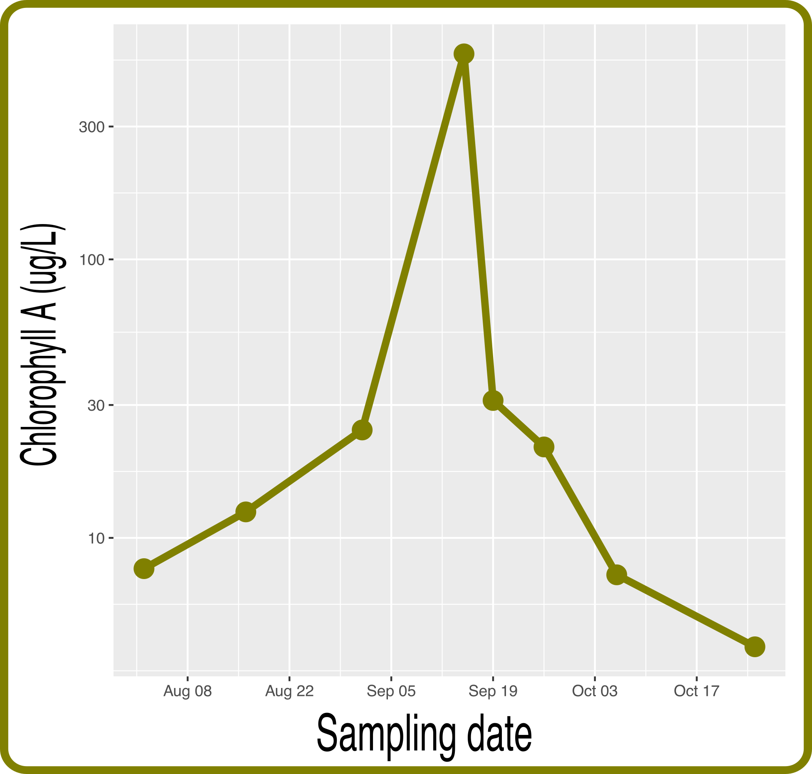

```{r setup, include=FALSE}
knitr::opts_chunk$set(echo = TRUE)
```
## Title
*Dolichospermum* evolution during during cyanobacterial bloom: insights from metatranscriptomics.

## Authors & Affiliations
Sébastien Renaut^1,2^
Nathalie Fortin^3^ 
Charles W. Greer^4^
Jesse B. Shapiro^2^


^1^Institut de Recherche en Biologie Végétale, Université de Montréal, Montréal, Québec, Canada  
^2^Department of Biological Sciences, Université de Montréal, Montreal, Quebec, H3T 1J4, Canada    
^3^  
^4^Energy Mining and Environment, National Research Council Canada, Montreal, QC, Canada  


## Abstract  
Specific environmental conditions, such as elevated levels of nutrients from human activities, warmer temperatures, still water, and sunlight promote the growth of cyanobacteria, which at high density, form harmfull algae blooms. Each summer, cyanobacteria make an appearance in Lake Champlain and pose health risks to humans and animals due to the production of cyanotoxins. Here, we used a metatranscriptomics approach that targets genes expressed in the water to identify changes in the bacterial community during the summer. At the height of the bloom (mid-September), chlorophyll A increased by nearly 100 fold and communities were dominated by the cyanobacteria *Dolichospermum circinale* and to a lesser extent *Microcystis aeruginosa*. 7,000 SNPs (10% of all SNPs) showed changes in allele frequencies in *Dolichospermum* from the begining of the bloom to the end in at least one of the sampling site, showing a highly dynamic evolution of the system. 19 genes showed repeatable patterns in all three sampling sites. These represent good candidates to predict bloom in the future.

## Introduction
* Specific environmental conditions, such as elevated levels of nutrients from human activities, warmer temperatures, still water, and sunlight promote the growth of cyanobacteria, which at high density, form harmfull algae blooms.
* Each summer, cyanobacteria make an appearance in Lake Champlain and pose health risks to humans and animals due to the production of cyanotoxins. 

## Objectives
* Use a metatranscriptomics approach that targets genes expressed in the water to identify changes in the bacterial community during the summer.

* Identify *Dolichospermum* (main bloom causing cyanobacteria) genes that change in allele (SNPs) frequency from the beginning to the end of the bloom. These represent good candidates to help to predict blooms in the future.


## Method
1. Water sampled at three location in Lake Champlain (St1, St2, PRM, **Figure 1: A map of sampling sites**) during a cyanobacterial bloom in the summer of 2016 (June 1st - October 10th).
2. RNA extracted, followed by High Throughput sequencing (100bp paired end Illumina HiSeq).
3. Metatranscriptomes processed (trimming, merging, removal of rRNA, annotation) using SAMSA2 pipeline [@westreich2018samsa2].
4. Sequences annotated to *Dolichospermum* (the main cyanobacteria responsible for the bloom) extracted and used to produce a *de novo* reference transcriptome assemblies using Trinity [@grabherr2011trinity]
6. *Dolichospermum* sequences aligned to transcriptome using bowtie2 [@langmead2012fast]. SNP called using SAMtools [@li2009sequence].
7. Changes in allele frequency quantified using logistic regressions in R.  
8. Candidate genes showing significant changes in allele frequency matched to reference database and compared against reference transcriptome.  

## Results 


{width=700px}

&nbsp;
&nbsp;
&nbsp;

 **Figure 1: A map of sampling sites**
 
 ***


{width=600px}

&nbsp;

**Figure 2: Chlorophyll concentration peaked in mid-September (August 1st: 7.8 ug/L, Sept 15th: 547 ug/L)**  

***


&nbsp;
&nbsp;
&nbsp;

{width=900px}

&nbsp;

 **Figure 3: Communities dominated by Gram negative *Fusobacterium* & *Acinetobacter* prior to bloom. During Bloom, *Dolichospermum circinale* rose in frequency, followed to a lesser extent by *Microcystis aeruginosa* in September.** 
 
 (An image of Dolicho anc Microcystis could be usefull)

***

&nbsp;
&nbsp;
&nbsp;

{width=900px}
&nbsp;

**Figure 4: A. Over 150k SNPs identified (<50% missing data: 72k). Venn diagram: Number of SNPs (genes) showing significant changes in allele frequency from beginning (June 1st) to end of bloom (October 6th). B. Example of a significant SNP in both St1, St2 (logistic regressions) and PRM (linear regression) sites (Total: 22 SNPs, 19 SNPs). C. Gene ontology groups for candidates (no significant over-represented groups compared to reference transcriptome)**

***

&nbsp;
&nbsp;
&nbsp;

## Conclusions
* Metatranscriptomics can identify cyanobacteria known to cause blooms (*Dolichospermum circinale*, *Microcystis aeruginosa*).
* ~7,000 SNPs (10% of all SNPs) show changes in allele frequencies during the bloom in at least one of the sampling site, showing a highly dynamic evolution of the system. 19 genes show repeatable changes in allele frequencies in all three sampling sites. These represent good candidates to predict bloom.
* Further sampling and sequencing in progress in other lakes will help to confirm patterns observed here.


```{r extra, echo=FALSE, eval=F}  

## Hypotheses
# Let's make some predictions

* metag and metat alpha-diversity are well correlated.
* DNA diversity exceed RNA diversity, suggesting that pathways are not proportionally transcribed by the community species that encode them.
* Many species have cyanotoxin genes, but few dominate.
* build a model to see what influences the correlation: high vs low expression genes? alpha diversity? 

* in Dolicho, most genes alleles frequencies should show the same pattern over time. If some genes show a diff. pattern, then they are under diff. selections. In those genes are related to cyanotoxins somehow, then this is really cool. Also, they could be diff expressed? or have non-synonymous mutations?   
1.Grep all Dolicho sequences in all samples.
2.Make a reference
3.Call SNPs on a sample per sample basis
4.Look at allele freq and find outliers
5.Investigate outliers.


## Intro
There are cyano blooms (dolicho + microcystis). The are costly. We want to use genetics to understand them better


## Hypo
Metat is a good method to ID blooms
Metat and metag are highly correlated
Few cyanot genes expressed

## Results

  + 1. Metat identifies the blooms correctly (barplot + foldchanges)
    + 1.1 There is a weird sludge on Sept 15th. (associated with peak i N, P, Cl - ugly picture of bloom)
  + 2. Metat and metag are highly correlated (cor plot, but also see how metag IDs the Microcystis better).
    + 2.1 Metat and metag are not well correlated for high expression genes (high expression)
  + 3. Many cyanotoxic genes expressed (barplot cyano)
  
  #Are these patterns repeatble: we are sampling more lakes?
  #Can some genes predict the evolution of the community of the year?
  
  


 Reference to Franzosa et al. 2018 (HUMAnN2)

```

```{r stats, echo=FALSE, eval=F}  
3. Transcriptome assembly + nb SNPs : Table 1 
nb genes: 4,897
nb genes with SNP: 2,286
nb SNPs: 72,055
nb significant SNPS
St1 (logistic regression): 1,493
St2 (logistic regression): 4,249
PRM (linear regression): 3,118
St1 $\cap$ St2: 282
St1 $\cap$ PRM: 388
St2 $\cap$ PRM: 160 
St1 $\cap$ St2 $\cap$ PRM: 22 (19 genes)
```


## References
